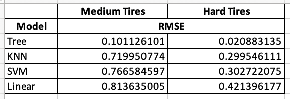

f1-capstone-project
# Forumala 1 Tire Degradation Modeling & Race Strategy Optimization

## Executive Summary
This project builds a predictive tire‑degradation model and race‑strategy simulation engine using real Formula 1 lap‑time data. 
Focusing on the 2025 Qatar Grand Prix (with drivers Max Verstappen and Oscar Piastri), the analysis quantifies how tire compound, stint length, 
and fuel load influence lap performance. Using exploratory data analysis (EDA), feature engineering, and a baseline machine‑learning model, 
the project produces a data‑driven framework for evaluating optimal pit‑stop strategies.

The results show that tire degradation follows a nonlinear pattern across compounds.   A Decision Tree Regressor serves as the baseline model, 
achieving the lowest RMSE among tested algorithms. The strategy engine uses this model to simulate full‑race outcomes 
under different pit‑stop plans, enabling evidence‑based comparison of 2‑stop vs. 3‑stop strategies.

**The project's models and race simulator correctly answer the business question, "Should we pit now, or stay out", with the "Pit Now!"**

## Rationale

Correctly answering the question "Should we pit now, or stay out" is the difference between winning and losing.  
After a race incident involving two cars on lap 7 of the 2025 Qatar Grand Prix, Red Bull properly chose to pit 
and won the race, whereas McLaren chose to stay out and lost the race.

A quantitative model that predicts lap‑time evolution and simulates race outcomes provides:

* A reproducible, data‑driven alternative to intuition‑based strategy
* A way to evaluate “what‑if” scenarios
* A foundation for more advanced modeling in Module 24 (global vs single-driver modeling)

This project demonstrates how machine learning can support strategic decision‑making in a high‑performance environment.

## Research Question
How can we model tire degradation and stint performance to predict total race time and identify 
the optimal pre-race and during-race pit‑stop strategy for the 2025 Qatar Grand Prix?

## Data Sources
The dataset consists of lap‑by‑lap timing and stint information for Max Verstappen during the 2025 Qatar Grand Prix.
Variables include:
* Lap time
* Tire compound
* Stint number
* Lap‑in‑stint
* Fuel‑corrected lap time (engineered feature)
* Track evolution indicators (engineered feature)

The dataset was cleaned to remove outliers (pit laps, safety‑car laps, anomalous slow laps) and 
structured for modeling.

## Methodology
The analysis follows a structured workflow:

**Exploratory Data Analysis (EDA)**
* Distribution analysis of lap times and stint lengths
* Compound‑level performance comparison
* Visualization of degradation curves
* Outlier detection and removal
* Correlation analysis
Feature engineering:
Fuel‑corrected lap time
Compound encoding
Stint progression features

**Baseline Machine Learning Model**
Several algorithms were tested:
* Linear Regression
* K‑Nearest Neighbors
* Support Vector Machine
* Decision Tree 

The **Decision Tree Regressor** was selected as the baseline model due to:
* Lowest RMSE
* Strong performance on nonlinear degradation patterns
* Interpretability

**Strategy Simulation Engine**
Using the baseline model, the project simulates:
* Full race time under different pit‑stop strategies
* Compound sequences (e.g., S‑M‑H, M‑H‑H, S‑S‑M‑H)
* Stint length variations
* Degradation‑driven lap‑time evolution

This enables direct comparison of 2‑stop vs. 3‑stop strategies.

## Results
**Key EDA Findings**
Medium tires offer balanced performance, with moderate degradation
Hard tires degrade slowest, providing the most stable long‑run pace
Fuel‑corrected lap times reveal a clear nonlinear degradation curve across both compounds

**Model Performance**

**Strategy Engine Findings**
* Simulated outcomes were tuned to match historical data
* Tire degradation model (SVM) was run against historical data and matched the 2025 Qatar results

## Next Steps
Module 24 will expand the project to evaluate global modeling across multiple drivers for a given race
Provide a more thorough analysis of model performance with tuning and cross validation

