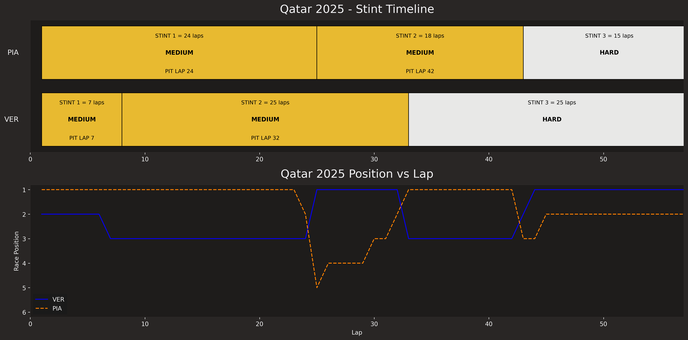
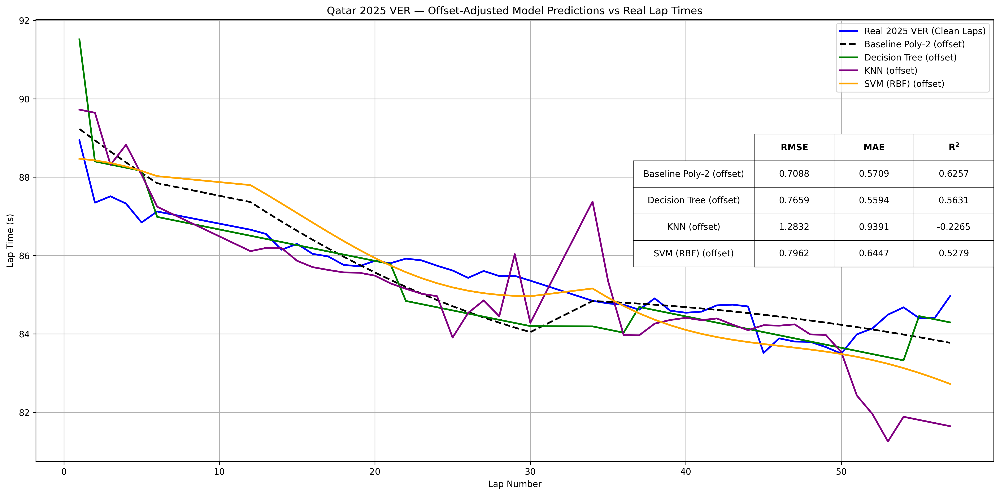
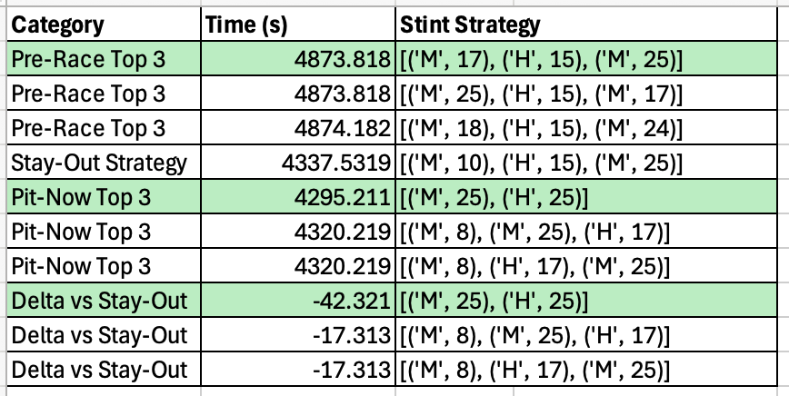
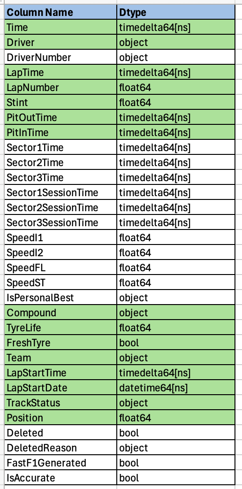
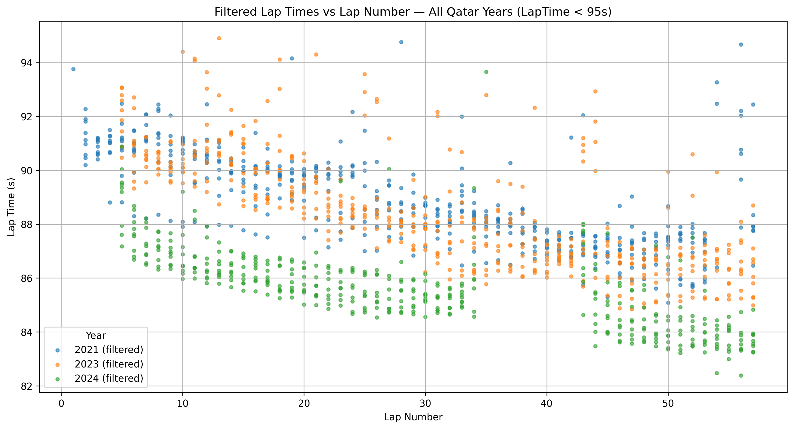
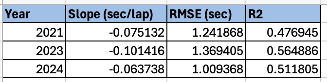

f1-capstone-project
# Formula 1 Tire Degradation Modeling & Race Strategy Optimization
Final Report by Jeff Goode
## Executive Summary
The goal of the project was to answer the question: **“As an F1 Team Principal, should we pit now or stay out?”.**   

As was evidenced in the 2025 Qatar Formula 1 Grand Prix, pitting at the wrong time can be the difference between winning and losing a race.

McLaren's Oscar Piastri started the race in 1st place, while Red Bull's Max Verstappen started the race in 2nd.  On lap 7, a yellow flag condition occurred.  Max as well as most of the field pitted and changed tires.  Oscar stayed out and pitted on lap 24 under normal green conditions.  Max won the race earning 25 points for the win, Oscar came in second place earning 18 points.  **The decision to stay out on lap 7 cost McLaren the race.** 

The 2025 season was won by McLaren's Lando Norris with 423 points vs Max Verstappen's 421 points further reinforcing the criticality of each race and each point. 

To answer the "pit now or stay out" question requires selecting a pit strategy that will minimize lap times which in turn requires predicting lap time based on **fuel burn** and **tire degradation**.  In this project predictive models were built for both as part of a race simulator.  Additionally, a strategy optimization engine was developed to iterate all possibilities of tire compounds and tire usage.

This project provides (outputs) optimal pre-race and race-day pit strategies, allowing the race engineer to answer the "pit now or stay out?" question on a lap-by-lap basis.

**Figure 1 - Max Verstappen's Qatar 2025 Winning Strategy**

### Findings

A linear regression model was selected to model fuel-burn and a 2nd-degree polynomial was selected as the best model for modeling tire degradation.  

Four models were evaluated for modeling tire degradation, see results in Figure 2 below.  As can be seen in the figure, 
Polynomial-2, Decision Tree, KNN, and SVM (RBF) were used to predict lap times for the test data, Max Verstappen’s 2025 Qatar results, shown by the blue line.The KNN and Decision Tree models produced jagged results and not indicative of real-tire degradation.  The SVM model produced smother curves, but because 
RMSE (0.7088), MAE (0.5709) were lower and R2 (0.6257) was higher, the **Poly-2 model** was chosen. Note: the **offset** term refers to adjustments needed to correct model lap times given current track and race car performance.  These adjustments are common during weekend practice and qualifying events.

**Figure 2 - Tire Degradation Models and Model Performance**

### Results and Conclusion

Using the top 10 drivers from prior Qatar races as the training set, and the poly-2 model for predicting tire degradation, the strategy optimizer correctly identified Max's pre-race strategy (Medium tires) and correctly identified the "pit now" decision on lap 7 (a 42-second savings using Medium tires for 25 laps, and Hard tires for 25 laps).  

**Table 1 - Tire Degradation Model and Strategy Optimizer Engine Results**

### Future Reseach and Development

**Probability of a Safety Car or Virtual Safety Car Event.**  Sometimes pit decisions should be delayed based on the probability of a SC or VSC event.  Coupling the probability of the event with tire (stint) age would yield a more realistic strategy engine.

**Treatment of Wet Weather Conditions**.  The model and strategy engine need to be modified to take into account weather and use of SOFT, WET and INTERMEDIATE tires as evidenced by the Canadian F1 2026 results shown in section 10.0 of the Jupyter notebook. 

**Scaleability**. In order to run new races requires a lot of copy and paste work.
Accordingly, the code should be refactored, wrappers developed, to enable functional calls versus running the code in line.  

### Next Steps and Recommendations
The Jupyter notebook demonstrates how the deployed code (section 6 of the Jupyter notebook) can be modified for the current Formula 1 season.  The example shown in section 10 of the notebook should be used to refactor the code to make it more production ready and easier to use for quick analysis (lap time filtering and model fit analysis).

## Rationale

Correctly answering the question **"Should we pit now, or stay out?"** is often the difference between winning and losing in Formula 1.

After a race incident involving two cars on lap 7 of the 2025 Qatar Grand Prix, Red Bull properly chose to pit and ultimately won the race, while McLaren chose to stay out and lost position and the race.

A quantitative model that predicts lap‑time evolution and simulates race outcomes provides:

* A reproducible, data‑driven alternative to intuition‑based strategy
* A way to evaluate “what‑if” scenarios
* A foundation for more advanced modeling (probability of a race incident, weather impact on tire choice, race traffic, undercut strategies)

This project demonstrates how machine learning can support strategic decision‑making in a high‑performance environment.
## Research Question
How can we model tire degradation and stint performance to predict total race time and identify the optimal pre-race and in-race pit‑stop strategy for the 2025 Qatar Grand Prix?

## Data Acquisition

The models used publicly available Formula 1 timing and telemetry data from [Formula1.com](https://formula1.com)
and [FastF1 API](https://theoehrly.github.io/Fast-F1/). These sources provided access to historical races by year, venue and driver. The FastF1 API is well documented as is the de facto source for historical F1 timing data. 

The FastF1 API data source had all the necessary timing data to enable development of the lap time models.  
Thirty-one columns of information are available per lap.  The project models used the columns indicated in green below in Table 2. 

**Table 2 - Per Lap Timing Data**

## Data Preprocessing/Preperation

As indicated by Table 2, all available timing data needed for model development was available via the FastF1 API – 
there were no missing values and inconsistencies, and there was no need to build proxies for missing data.

The training data consisted of three Qatar races (2021, 2023, 2024) for the top 10 finishers with Max Verstappen’s lap information held out.   The test set was Max Verstappen’s lap information for Qatar 2025.  

Filtering out outlier data due to slow laps (pitting, yellow conditions, etc.) is essential - for Qatar the filter was set at 95 seconds.   

**Figure 3 Test Data Post Slow Lap Filtering**
## Modeling

The project utilized two supervised regression models, a linear regression model for predicting fuel-load lap time reduction and
a 2nd degree polynomial for predicting tire degradation. 
## Methodology
The analysis followed a structured workflow:

**Exploratory Data Analysis (EDA)**
* Distribution analysis of lap times and stint lengths
* Compound‑level performance comparison
* Visualization of degradation curves
* Outlier detection and removal
* Correlation analysis
* Feature engineering:
  * Fuel‑corrected lap time
  * Compound encoding
  * Stint progression features

**Baseline Machine Learning Model**

Several algorithms were tested:
* Linear Regression
* Polynomial Regression
* K‑Nearest Neighbors
* Support Vector Machine
* Decision Tree 

Initially (in a Module 20 Berkeley submission), the **Decision Tree** was selected as the **baseline model** due to:
* Lowest RMSE among the tested algorithms
* Strong performance on nonlinear degradation patterns
* Interpretability

For the second stage of this capstone project (Module 24 Berkeley submission) a formal training set and test set were identified.  Using that training set, and performing subsequent analysis indicated that a 2nd degree polynomial was the best model and the baseline model was changed. 

## Modeling Evaluation 

The Linear Regression model is well documented in the F1 community as the best model for modeling fuel burn or fuel-load with laps getting 
faster per lap as the car gets lighter due to a reduced fuel mass.  See Figure 2 below for the results of the fuel-load modeling.

**Figure 2  - Fuel Load Model Performance**

Four models were evaluated for modeling tire degradation, see results in Figure 3 below.  As can be seen in the figure below, 
Polynomial-2, Decision Tree, KNN, and SVM (RBF) were used to predict lap times for the test data, Max Verstappen’s 2025 Qatar results, shown by the blue line.   
The KNN and Decision Tree models produced jagged results and not indicative of real-tire degradation.  The SVM model produced smother curves, but because 
RMSE (0.7088), MAE (0.5709) were lower and R2 (0.6257) was higher, the Poly-2 model was chosen.  

**Figure 3 Tire Degradation Models and Model Performance**

## Outline of project

[Link to Capstone Notebook](notebooks/f1.ipynb)

[Link to Notebook Final Summary](notebooks/f1.ipynb#7.0FinalSummary)

## Contact and Further Information

Jeff Goode

Email: jeffreylgoode@gmail.com

[LinkedIn](https://www.linkedin.com/in/jeffreylgoode/)
